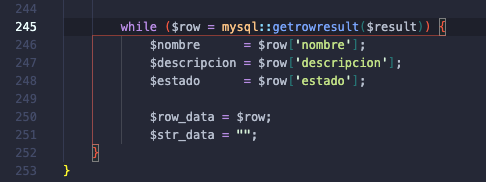
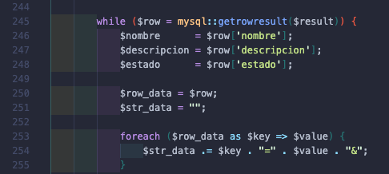
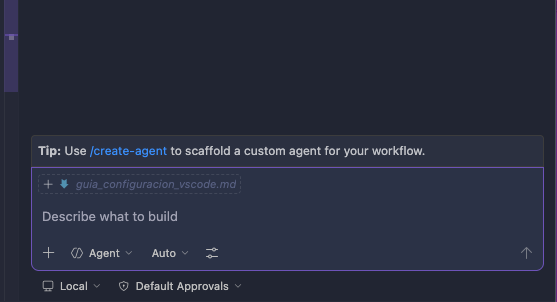
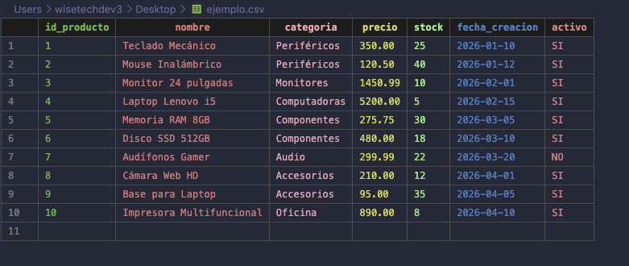
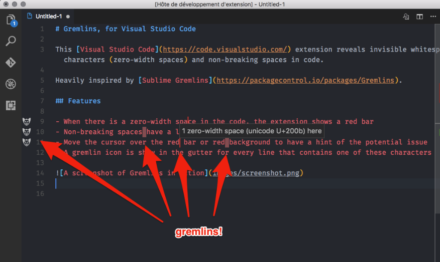
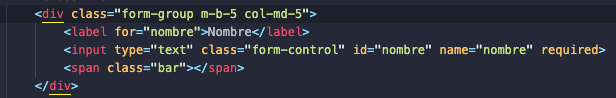
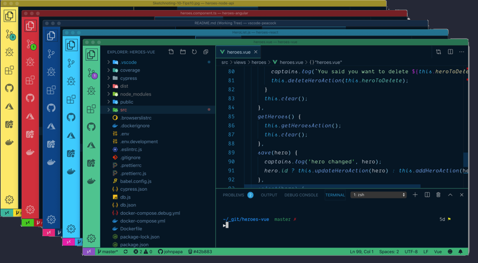

# Guía de Configuración de VS Code para Nuevos Desarrolladores

El propósito de este documento es establecer una base estándar de configuración en Visual Studio Code (VS Code), con el fin de mejorar la legibilidad, consistencia y calidad del código, facilitando su revisión y mantenimiento.

---

## 1. Instalación de extensiones en VS Code

Las extensiones permiten ampliar las funcionalidades del editor y adaptarlo a las necesidades del equipo de desarrollo de WiseTech.

### Pasos para instalar una extensión:

1. Abrir Visual Studio Code.
2. Dirigirse al panel de **Extensiones** ubicado en la barra lateral izquierda.
   - También puede acceder utilizando el atajo: `Command + Shift + X`.
3. En la barra de búsqueda, ingresar el nombre de la extensión que desea instalar.
4. Seleccionar la extensión correspondiente en la lista de resultados.
5. Hacer clic en el botón **Install (Instalar)**.

**Es recomendable verificar que la extensión sea del autor indicado para evitar instalar versiones no oficiales.**

---

## 2. Cambio de tema de color

El uso de un tema adecuado mejora significativamente la experiencia visual y la comprensión del código.

### Pasos para cambiar el tema:

1. Presionar `Command + Shift + P` o `F1` para abrir la paleta de comandos.
2. Escribir: `Color Theme`.
3. Seleccionar la opción **Preferences: Color Theme**.
4. Elegir el tema de su preferencia de la lista disponible.

**Se recomienda utilizar temas oscuros, ya que reducen la fatiga visual durante sesiones prolongadas de trabajo.**

---

## 3. Extensiones requeridas

A continuación se detallan las extensiones que deben instalarse, junto con su funcionalidad y beneficios dentro del flujo de trabajo de WiseTech.

---

### Rainbow Brackets

**Autor:** Mhammed Talhaouy

**Descripción:**  
Esta extensión asigna colores diferentes a cada nivel de paréntesis, llaves y corchetes dentro del código.

**Utilidad:**  
Permite identificar de manera visual la apertura y cierre de estructuras anidadas, lo cual es especialmente útil en funciones complejas o bloques con múltiples niveles de profundidad.

**Beneficio práctico:**  
Reduce errores relacionados con el mal cierre de estructuras y facilita la lectura del código durante revisiones.

---

### phpmt - PHP formatter

**Autor:** kokororin

**Descripción:**  
Herramienta de formateo automático para código PHP que aplica reglas de estilo predefinidas.

**Utilidad:**  
Estandariza la estructura del código, incluyendo indentación, espacios, saltos de línea y organización general.

**Beneficio práctico:**  
Evita inconsistencias entre nuestros desarrolladores y asegura que todo el código siga un mismo formato, lo cual es fundamental para revisiones y mantenimiento.

---

### PHP Intelephense

**Autor:** intelephense

**Descripción:**  
Motor de análisis de código PHP que proporciona autocompletado inteligente, navegación entre archivos y detección de errores.

**Utilidad:**  
Analiza el código en tiempo real y ofrece sugerencias contextuales basadas en clases, funciones y variables.

**Beneficio práctico:**  
Aumenta la productividad, reduce errores comunes y facilita la comprensión de proyectos grandes o heredados.

---

### indent-rainbow

**Autor:** oderwat

**Descripción:**  
Extensión que colorea los niveles de indentación en el código.

**Utilidad:**  
Permite distinguir visualmente la estructura jerárquica del código, especialmente en bloques condicionales, ciclos y funciones.

**Beneficio práctico:**  
Ayuda a detectar problemas de indentación y mejora la organización visual del código, haciéndolo más claro para cualquier lector.

---

### GitHub Copilot Chat

**Autor:** GitHub

**Descripción:**  
Asistente de desarrollo basado en inteligencia artificial que permite interactuar mediante chat dentro del editor.

**Utilidad:**  
Puede generar fragmentos de código, explicar funciones existentes, sugerir mejoras y resolver dudas directamente en el entorno de desarrollo.

**Beneficio práctico:**  
Acelera el proceso de desarrollo, apoya en la resolución de problemas y sirve como herramienta de aprendizaje continuo.

---

### CSV

**Autor:** ReprEng

**Descripción:**  
Extensión diseñada para mejorar la visualización y manipulación de archivos en formato CSV.

**Utilidad:**  
Organiza los datos en columnas alineadas, facilita la lectura de archivos grandes y permite trabajar con información tabular de manera más eficiente.

**Beneficio práctico:**  
Evita errores al interpretar datos y mejora la productividad al trabajar con archivos estructurados.

---

### Gremlins tracker for Visual Studio Code

**Autor:** Nicolas Hoisey

**Descripción:**  
Esta extensión detecta y resalta caracteres invisibles o problemáticos dentro del código, tales como espacios en blanco innecesarios, saltos de línea incorrectos o caracteres Unicode ocultos.

**Utilidad:**  
Permite identificar elementos que no son visibles a simple vista pero que pueden causar errores, problemas de formato o comportamientos inesperados en el código.

**Beneficio práctico:**  
Evita errores difíciles de detectar durante revisiones y asegura que el código se mantenga limpio, consistente y libre de caracteres no deseados.

---

### Highlight Matching Tag

**Autor:** vincaslt

**Descripción:**  
Resalta automáticamente la etiqueta de apertura y cierre correspondiente en archivos HTML, XML y similares.

**Utilidad:**  
Facilita la navegación y comprensión de estructuras basadas en etiquetas, especialmente en documentos con múltiples niveles de anidación.

**Beneficio práctico:**  
Reduce errores al trabajar con etiquetas mal cerradas y mejora la velocidad al identificar bloques relacionados dentro del código.

---

### Peacock

**Autor:** John Papa

**Descripción:**  
Permite cambiar el color del entorno de trabajo de VS Code, asignando un color distintivo a cada proyecto o ventana.

**Utilidad:**  
Ayuda a diferenciar visualmente múltiples instancias de VS Code abiertas al mismo tiempo.

**Beneficio práctico:**  
Reduce la posibilidad de cometer errores al trabajar en proyectos distintos, evitando confusiones entre entornos (por ejemplo, desarrollo, pruebas o producción).

---

### Prettier - Code formatter

**Autor:** Prettier

**Descripción:**  
Formateador de código automático que soporta múltiples lenguajes, incluyendo JavaScript, HTML, CSS, JSON, entre otros.

**Utilidad:**  
Aplica reglas consistentes de formato al guardar archivos, asegurando una estructura uniforme en todo el código.

**Beneficio práctico:**  
Mejora la legibilidad, reduce discusiones sobre estilo entre desarrolladores y garantiza que el código cumpla con estándares definidos sin intervención manual.

---

## Recomendaciones finales

- Mantener Visual Studio Code y todas las extensiones actualizadas.
- Utilizar estas herramientas de forma consistente en todos los proyectos.
- Priorizar siempre la claridad y legibilidad del código sobre soluciones innecesariamente complejas.
- Asegurarse de aplicar formatos y buenas prácticas antes de entregar código para revisión.

---
